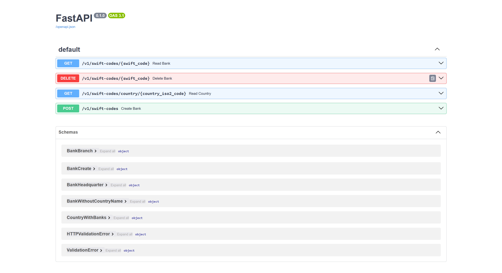
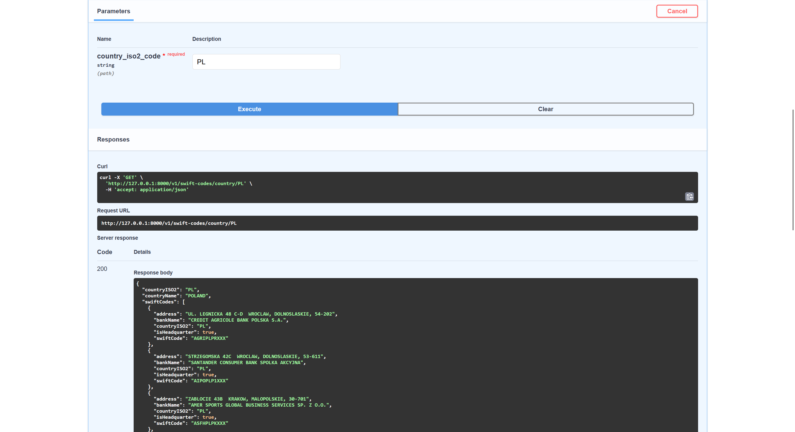

# REST API for SWIFT codes

This is a REST API developed in Python ([SQLModel](https://sqlmodel.tiangolo.com/) and [FastAPI](https://fastapi.tiangolo.com/)) based on the [requirements](task_requirements/task_requirements.docx).

In order to run it, you should change your directory to `swift-codes-app`:

```
cd swift-codes-app
```

And run Docker with the following commands:

```
docker build -t swift-codes-app-image .
docker run -d --name swift-codes-app-container -p 8000:8000 swift-codes-app-image
```

Then, you can use Swagger UI at [http://127.0.0.1:8000/docs](http://127.0.0.1:8000/docs) to interact with the database through the interface presented below.


